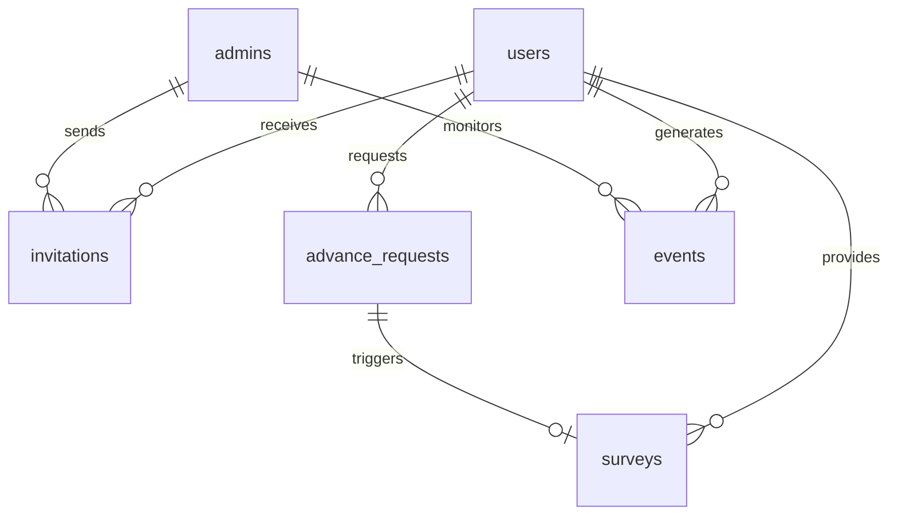

# Data Contract & Schema Engineering (`docs/schema.md`)

## 1. Objective

Ensure complete system-wide data integrity for the Salary Advance Pilot App. This schema locks the entities, relationships, and constraints before application logic is written, ensuring a reliable and observable system.

## 2. Timezone Convention

All timestamp columns use `TIMESTAMPTZ` (stored in UTC). Business-logic date boundaries (request window, daily/monthly limits) **must** be evaluated in the `Africa/Douala` timezone (WAT, UTC+1), which is Cameroon's local time. Partial indexes and queries use `created_at AT TIME ZONE 'Africa/Douala'` to avoid off-by-one-day errors at the UTC/WAT boundary.

## 3. Entity-Relationship Overview



## 4. SQL DDL (PostgreSQL 17)

### Enums and Extensions

```sql
CREATE EXTENSION IF NOT EXISTS "uuid-ossp";

CREATE TYPE request_status AS ENUM ('initiated', 'pending', 'success', 'failed');
CREATE TYPE user_status AS ENUM ('active', 'suspended');
CREATE TYPE invitation_status AS ENUM ('sent', 'accepted', 'expired', 'revoked');
```

### Tables

#### Admins

```sql
CREATE TABLE admins (
    id UUID PRIMARY KEY DEFAULT uuid_generate_v4(),
    email TEXT UNIQUE NOT NULL,
    firebase_uid TEXT UNIQUE NOT NULL,
    created_at TIMESTAMPTZ NOT NULL DEFAULT NOW()
);
```

#### Users (Employees)

```sql
CREATE TABLE users (
    id UUID PRIMARY KEY DEFAULT uuid_generate_v4(),
    email TEXT UNIQUE NOT NULL,
    email_verified BOOLEAN NOT NULL DEFAULT FALSE,
    firebase_uid TEXT UNIQUE NOT NULL,
    full_name TEXT,
    phone_number TEXT NOT NULL,       -- Primary identity, verified via Firebase Phone Auth
    phone_verified BOOLEAN NOT NULL DEFAULT FALSE,
    status user_status NOT NULL DEFAULT 'active',
    is_terms_accepted BOOLEAN NOT NULL DEFAULT FALSE,
    terms_accepted_at TIMESTAMPTZ,
    terms_version TEXT,
    user_ip_at_consent INET,
    created_at TIMESTAMPTZ NOT NULL DEFAULT NOW(),
    updated_at TIMESTAMPTZ NOT NULL DEFAULT NOW()
);
```

> **Note:** `updated_at` has no auto-update trigger. All Go update queries **must** explicitly set `updated_at = NOW()`. This is a deliberate application-layer responsibility — see `AGENTS.md`.

#### Invitations

```sql
CREATE TABLE invitations (
    id UUID PRIMARY KEY DEFAULT uuid_generate_v4(),
    email TEXT NOT NULL,
    status invitation_status NOT NULL DEFAULT 'sent',
    invited_by UUID REFERENCES admins(id),
    sent_at TIMESTAMPTZ NOT NULL DEFAULT NOW(),
    accepted_at TIMESTAMPTZ
);

-- Allows re-inviting the same email after expiration/revocation.
-- Only one active (non-expired, non-revoked) invitation per email.
CREATE UNIQUE INDEX idx_one_active_invitation_per_email
ON invitations (email) WHERE (status IN ('sent', 'accepted'));
```

#### Advance Requests

```sql
CREATE TABLE advance_requests (
    id UUID PRIMARY KEY DEFAULT uuid_generate_v4(),
    user_id UUID NOT NULL REFERENCES users(id),
    amount_xaf NUMERIC(10, 2) NOT NULL DEFAULT 10000.00 CHECK (amount_xaf = 10000.00),
    status request_status NOT NULL DEFAULT 'initiated',
    campay_payout_ref TEXT UNIQUE,
    failure_reason TEXT,
    payout_duration_seconds INTEGER,
    created_at TIMESTAMPTZ NOT NULL DEFAULT NOW(),
    updated_at TIMESTAMPTZ NOT NULL DEFAULT NOW()
);

-- Constraint: Maximum one request attempt per day per user (Cameroon time)
CREATE UNIQUE INDEX idx_one_request_per_day
ON advance_requests (user_id, ((created_at AT TIME ZONE 'Africa/Douala')::DATE));

-- Constraint: Only one successful advance allowed per calendar month (Cameroon time)
CREATE UNIQUE INDEX idx_one_success_per_month
ON advance_requests (
    user_id,
    EXTRACT(MONTH FROM created_at AT TIME ZONE 'Africa/Douala'),
    EXTRACT(YEAR FROM created_at AT TIME ZONE 'Africa/Douala')
) WHERE (status = 'success');

CREATE INDEX idx_advance_requests_user_id ON advance_requests (user_id);
```

> **Important:** The request window (15th–last day of month) is enforced in **application logic** using Cameroon-local time, not via a SQL `CHECK` constraint. A DB-level `CHECK` using `EXTRACT(DAY ...)` would reject legitimate requests due to timezone skew between UTC and WAT, and would also block test data inserts outside the window.

#### Event Logs (Observability)

```sql
CREATE TABLE events (
    id UUID PRIMARY KEY DEFAULT uuid_generate_v4(),
    user_id UUID REFERENCES users(id),
    admin_id UUID REFERENCES admins(id),
    event_type TEXT NOT NULL, -- e.g., 'otp_sent', 'payout_success'
    metadata JSONB,           -- Contextual data
    created_at TIMESTAMPTZ NOT NULL DEFAULT NOW()
);

CREATE INDEX idx_events_user_id ON events (user_id);
CREATE INDEX idx_events_event_type ON events (event_type);
CREATE INDEX idx_events_created_at ON events (created_at);
```

#### Surveys

```sql
CREATE TABLE surveys (
    id UUID PRIMARY KEY DEFAULT uuid_generate_v4(),
    user_id UUID NOT NULL REFERENCES users(id),
    request_id UUID NOT NULL REFERENCES advance_requests(id),
    satisfaction_score INTEGER CHECK (satisfaction_score BETWEEN 1 AND 5),
    feedback TEXT,
    created_at TIMESTAMPTZ NOT NULL DEFAULT NOW(),
    UNIQUE (user_id, request_id)   -- One survey per request per user
);
```

#### System Config (Kill Switch)

```sql
CREATE TABLE system_config (
    key TEXT PRIMARY KEY,
    value JSONB NOT NULL,
    updated_at TIMESTAMPTZ DEFAULT NOW()
);
```

> **Migration note:** The kill-switch seed row must live in a separate migration file (e.g., `migrations/000002_seed_kill_switch.sql`), not in the DDL schema file:
> ```sql
> INSERT INTO system_config (key, value) VALUES ('kill_switch', '{"active": false}');
> ```

## 5. Integrity & Cascading Rules

- **Foreign Keys:** `ON DELETE RESTRICT` for users and requests to preserve audit trails.
- **Strict Checks:** `amount_xaf` is hard-locked to 10000.00.
- **Timestamps:** All tables include `created_at` with `TIMESTAMPTZ` to ensure absolute time tracking across timezones.
- **`updated_at`:** No auto-update trigger. Go service layer must explicitly set `updated_at = NOW()` on every write.

## 6. Resolved Design Decisions

| Question | Resolution |
| :--- | :--- |
| **Payday Reset Logic:** If a user gets an advance on Jan 31, can they get another on Feb 15? | **Calendar month.** The "one success per month" rule resets on the 1st of each calendar month. A request on Jan 31 and Feb 15 are in different months and both allowed. Enforced via `idx_one_success_per_month` partial unique index. |
| **Phone Verification Method:** Campay 5 XAF collection or OTP? | **Firebase Phone OTP.** Phone number is the primary identity. Email is verified separately via Resend OTP. Both must be verified before signup completes. No `phone_verifications` table needed for MVP. |
| **Data Retention:** What happens to user data after the pilot? | **Retain indefinitely.** All data is preserved for audit, compliance, and analysis. No automated deletion schedule is applied post-pilot. |

## 7. Backup & Recovery Strategy

### Point-In-Time Recovery (PITR) Parameters

- **Database Engine:** PostgreSQL 17 (Supabase/Neon).
- **WAL Archiving:** Continuous Write-Ahead Logging (WAL) archiving enabled.
- **Recovery Point Objective (RPO):** < 5 minutes.
- **Retention Period:** 30 days of PITR history.
- **Verification Strategy:**
    - Monthly "Dry Run" restoration to a temporary instance.
    - Automated integrity check (pg_checksums) during backup.
    - Snapshot validation: Querying `events` table count from the restored instance vs. production.